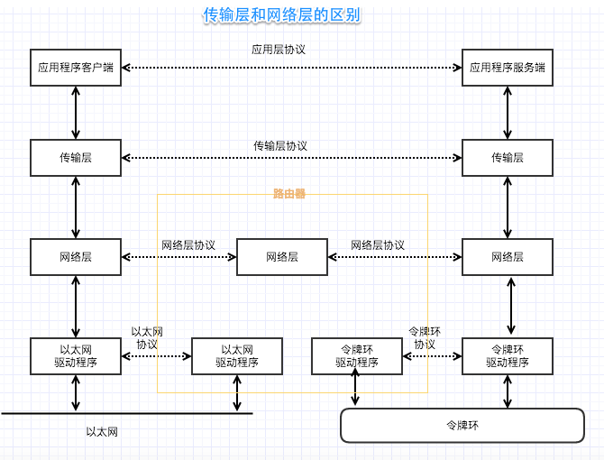
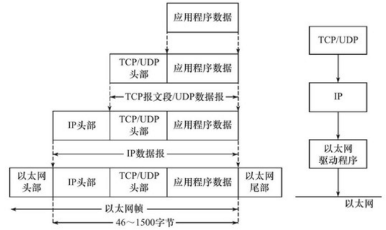
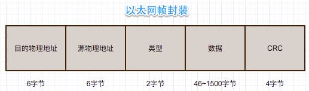
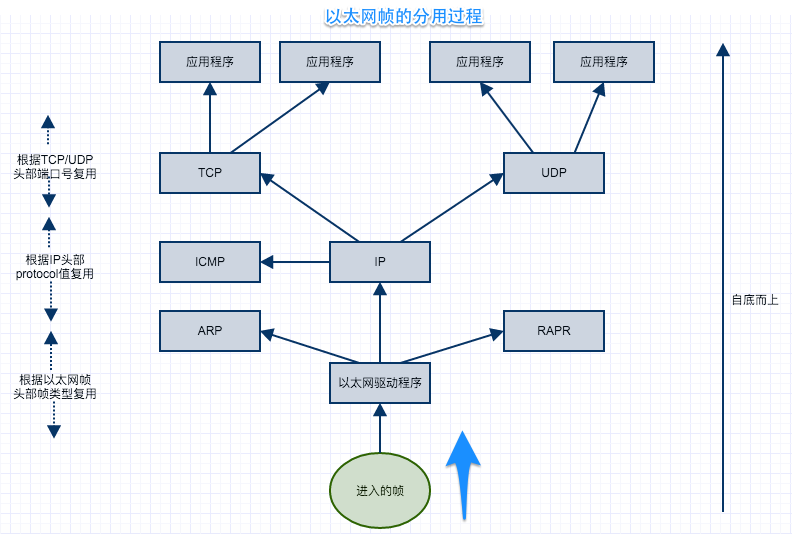
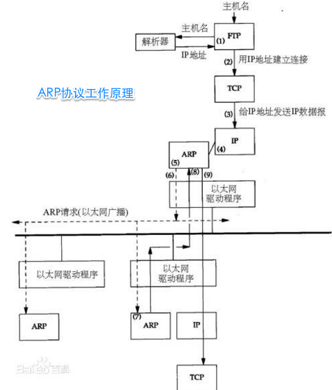
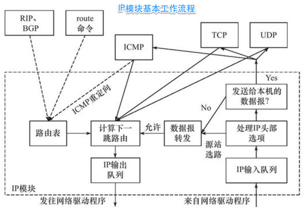
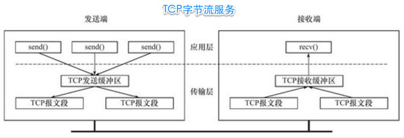
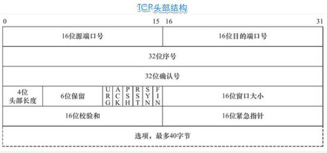

第一篇 TCPIP协议详解

- 第1章 TCPIP协议族
- 第2章 IP协议详解
- 第3章 TCP协议详解
- 第4章 TCP/IP通信案例：访问Internet上的Web服务器

# 一.TCP/IP协议族

TCP/IP协议族体系结构及主要协议如下图：

画图工具为chrome插件：Gliffy Diagrams

从下至上分析：

## 1.1 数据链路层
最底层了，它是一个**实现了网卡接口的网络驱动程序，处理数据在物理媒介如以太网，令牌环上传输， 为上层协议提供了一个统一的抽象化(隐藏细节)的接口。**

>网络层使用IP地址寻址一台机器，而数据链路层使用物理地址寻址一台机器，因此网络层必须先将目标机器的IP地址转化成其物理地址，才能使用数据链路层提供的服务，这就是ARP协议的用途。RARP协议仅用于网络上的某些无盘工作站。

上图可知数据链路层的协议主要有：

- [ARP协议](http://baike.baidu.com/subview/32698/16532303.htm?fromtitle=ARP%E5%8D%8F%E8%AE%AE&fromid=1742212&type=syn)（Address Resolve Protocol，地址解析协议)，根据IP地址获取物理地址。
- [RARP协议](http://baike.baidu.com/view/876146.htm?fromtitle=RARP&fromid=610685&type=syn)（Reverse Address Resolve Protocol，逆地址解析协议），允许局域网的物理机器从网关服务器的 ARP 表或者缓存上请求其 IP 地址。

它们实现了IP地址和机器物理地址（通常是MAC地址，以太网、令牌环和802.11无线网络都使用MAC地址）之间的相互转换。

## 1.2 网络层
>网络层实现了数据包的选路和转发。因为通信的两台主机可能不是直连的，而是通过多个中间节点（路由器）连接的。网络层的任务就是选择这些中间节点，以确定两台主机之间的通信路径。

网络层核心协议是IP协议（Internet Protocol，因特网协议），IP协议使用逐跳(hop by hop)的方式确定通信路径。

## 1.3 传输层
>传输层为两台主机上的应用程序提供端到端（end to end）的通信。与网络层使用的逐跳通信方式不同，传输层只关心通信的起始端和目的端，而不在乎数据包的中转过程。

其中传输层和网络层的区别如下图：

注释：

- 实线代表协议层的实体通信
- 水平虚线表示逻辑通信线路

**可见：**

- 数据链路层（驱动程序）封装了物理网络的电气细节；
- 网络层封装了网络连接的细节；
- 传输层则为应用程序封装了一条端到端的逻辑通信链路，它负责数据的收发、链路的超时重连等。

**传输层协议主要有三个：TCP协议、UDP协议和SCTP协议。**

## 1.4 应用层
应用层负责处理应用程序的逻辑，不涉及网络通信细节，在用户空间实现。而数据链路层、网络层和传输层这部分必须及稳定又高效，因此它们在内核空间实现。

**应用层（某些服务器程序）也可以放在内核态，这样就避免了用户空间和内核空间来回切换（主要是数据的复制）的耗时，但是会显得内核态太庞杂，不好移植，所以我们讨论用户空间的网络编程。**

应用层的协议是最多的，如：

- ping, 是应用程序，不是协议，它利用ICMP报文检测网络连接，是调试网络环境的必备工具。
- telnet协议是一种远程登录协议（明文）
- OSPF（Open Shortest Path First，开放最短路径优先）
- DNS（Domain Name Service，域名服务）

## 1.5 封装
上层协议通过封装细节与下层协议交互，每层协议都将在上层数据的基础上加上自己的头部信息（有时还包括尾部信息），以实现该层的功能，这个过程就称为封装，如

在上面的应用层知道，用户态到内核态的切换则是数据的复制，应用程序数据复制到内核态的内核缓冲区（发送缓冲区或接受缓冲区）。那么经过TCP封装后的数据称为TCP报文段，TCP头部信息和TCP内核缓冲区（发送缓冲区或接收缓冲区）数据一起构成了TCP报文段。如下TCP报文段封装过程：

经过UDP封装后的数据称为UDP数据报（UDP datagram）

与TCP封装过程类似，不同的是，UDP无须为应用程序数据保存副本，它提供的服务是不可靠的。当一个UDP数据报被成功发送之后，UDP内核缓冲区中的该数据报就被**丢弃**了。如果应用程序检测到该数据报未能被接收端正确接收，并打算重发这个数据报，则应用程序需要重新从用户空间将该数据报拷贝到UDP内核发送缓冲区中。

经过IP封装后的数据称为IP数据报（IP datagram）

经过数据链路层封装的数据称为帧（frame），传输媒介不同，帧的类型也不同。比如，以太网上传输的是以太网帧（ethernet frame），而令牌环网络上传输的则是令牌环帧（token ring frame）。

>帧的最大传输单元（Max Transmit Unit，**MTU**），即帧最多能携带多少上层协议数据（比如IP数据报），通常受到网络类型的限制。上图所示的以太网帧的MTU是**1500字节**。正因为如此，过长的IP数据报可能需要被**分片（fragment）**传输。**帧才是最终在物理网络上传送的字节序列**。至此，封装过程完成。

## 1.6 分用
上面的封装是个自上而下的封装过程，当帧到达目的主机时，将沿着协议栈自下向上依次传递。

>各层协议依次处理帧中本层负责的头部数据，以获取所需的信息，并最终将处理后的帧交给目标应用程序。这个过程称为**分用（demultiplexing）**

帧通过上述分用步骤后，最终将封装前的原始数据送至目标服务（如图中的ARP服务、RARP服务、ICMP服务或者应用程序）

## 1.7 ARP协议工作原理
ARP协议能实现任意网络层地址到任意物理地址的转换，这里只讨论从IP地址到以太网地址（MAC地址）的转换。

其工作原理可参考[百度百科](http://baike.baidu.com/subview/32698/16532303.htm?fromtitle=ARP%E5%8D%8F%E8%AE%AE&fromid=1742212&type=syn)

如主机A要与主机B通信：

1. 主机A通过路由表确定主机B的IP，然后A主机在自己的本地ARP缓存中检查主机B的匹配MAC地址。
2. 如果主机A在ARP缓存中没有找到映射，会询问B的IP的硬件地址，从而将ARP请求帧广播到本地网络上的所有主机源主机A的IP地址和MAC地址都包括在ARP请求中。本地网络上的每台主机都接收到ARP请求并且检查是否与自己的IP地址匹配。如果主机发现请求的IP地址与自己的IP地址不匹配，它将丢弃ARP请求。
3. 主机B确定ARP请求中的IP地址与自己的IP地址匹配，则将主机A的IP地址和MAC地址映射添加到本地ARP缓存中。
4. 主机B将包含其MAC地址的ARP回复消息直接发送回主机A。
5. 当主机A收到从主机B发来的ARP回复消息时，会用主机B的IP和MAC地址映射更新ARP缓存。本机缓存是有生存期的，生存期结束后，将再次重复上面的过程。主机B的MAC地址一旦确定，主机A就能向主机B发送IP通信了。

其工作原理可下图概况：

## 1.8 socket和TCP/IP协议族的关系

在第一张图中可知socket基于传输层和应用层中间，数据链路层、网络层、传输层协议是在内核中实现的。因此操作系统需要实现一组系统调用，使得应用程序能够访问这些协议提供的服务，那么**socket**系统调用的API就是用户空间和内核空间的媒介。

由socket定义的这一组API提供如下两点功能：

1. 将应用程序数据从用户缓冲区中复制到TCP/UDP内核发送缓冲区，以交付内核来发送数据（如上图所示的send函数），或者是从内核TCP/UDP接收缓冲区中复制数据到用户缓冲区，以读取数据；
2. 应用程序可以通过它们来修改内核中各层协议的某些头部信息或其他数据结构，从而精细地控制底层通信的行为。比如可以通过setsockopt函数来设置IP数据报在网络上的存活时间。

# 二.IP协议详解
主要基于IPv4学习。

IP协议是TCP/IP协议族的动力，它为上层协议提供**无状态、无连接、不可靠**的服务。

- 无状态（stateless）是指IP通信双方不同步传输数据的状态信息，优点的简单高效，速度快；缺点是无法处理乱序和重复的IP数据报，当接收到完整数据报(如IP分片的话)则传给上层协议，如果上层是TCP协议则TCP协议能够自己处理乱序的、重复的报文段。
- 无连接（connectionless）是指IP通信双方都不长久地维持对方的任何信息。这样，上层协议每次发送数据的时候，都必须明确指定对方的IP地址。
- 不可靠是指IP协议不能保证IP数据报准确地到达接收端，它只是承诺尽最大努力（best effort）。很多种情况都能导致IP数据报发送失败。比如，某个中转路由器发现IP数据报在网络上存活的时间太长（根据IP数据报头部字段TTL判断，见后文），那么它将丢弃之，并返回一个ICMP错误消息（超时错误）给发送端。又比如，接收端发现收到的IP数据报不正确（通过校验机制），它也将丢弃之，并返回一个ICMP错误消息（IP头部参数错误）给发送端。无论哪种情况，发送端的IP模块一旦检测到IP数据报发送失败，就通知上层协议发送失败，而不会试图重传。因此，使用IP服务的上层协议（比如TCP协议）需要自己实现数据确认、超时重传等机制以达到可靠传输的目的。

## 2.1 IPv4头部结构

在《图解TCP/IP》第四章的IPv4首部讲得比较详细，这里精简文字吧。

- 4位版本号： 指定IP协议的版本。对IPv4来说，其值是4。
- 4位头部长度：标识该IP头部有多少个32 bit字（4字节）。因为4位最大能表示15，所以IP头部最长是60字节。
- 8位服务类型（Type Of Service，TOS）： (3+1+4)包括一个3位的优先权字段（现在已经被忽略），4位的TOS字段和1位保留字段（必须置0）。**4位的TOS字段分别表示：最小延时、最大吞吐量、最高可靠性和最小费用**。其中最多有一个能置为1，应用程序应该根据实际需要来设置它。比如像ssh和telnet这样的登录程序需要的是最小延时的服务，而文件传输程序ftp则需要最大吞吐量的服务。
- 16位总长度（total length）：是指整个IP数据报的长度，以字节为单位，因此IP数据报的最大长度为65 535（2^{16}-1）字节。但由于MTU的限制，长度超过MTU的数据报都将被分片传输，所以实际传输的IP数据报（或分片）的长度都远远没有达到最大值。
- 16位标识、3位标志、13位分片偏移都是用于IP分片用的
- 8位生存时间（Time To Live，TTL）：是数据报到达目的地之前允许经过的路由器跳数。TTL值被发送端设置（常见的值是64）。数据报在转发过程中每经过一个路由，该值就被路由器减1。当TTL值减为0时，路由器将丢弃数据报，并向源端发送一个ICMP差错报文。TTL值可以防止数据报陷入路由循环。
- 8位协议：用来区分上层协议
- 16位头部校验和（header checksum）： 由发送端填充，接收端对其使用CRC算法以检验IP数据报头部（注意，仅检验头部）在传输过程中是否损坏。

使用`tcpdump`命令抓取本机回路上的数据包

	sudo tcpdump -ntx -i lo0

数据解释可参考[使用tcpdump观察TCP头部信息](http://book.51cto.com/art/201306/400264.htm)

## 2.2 IP分片

- IP数据报长度超过帧的MTU时，才会发生分片
- 分片可发生在发送端，中转路由器等
- IP头部三字段：16位标识、3位标志、13位分片偏移都是用于IP分片和重组
- 一个IP数据报的每个分片都具有自己的IP头部，它们具有相同的标识值，但具有不同的片偏移。
- 除了最后一个分片外，其他分片都将设置`MF`标志
- 每个分片的IP头部的总长度字段将被设置为该分片的c长度

以太网帧的MTU是**1500字节**,因此它携带的IP数据报的数据部分最多是**1480字节**（IP头部占用**20字节**）。考虑用IP数据报封装一个长度为**1481字节**的ICMP报文（包括**8字节**的ICMP头部（ICMP报文的头部长度取决于报文的类型），所以其数据部分长度为**1473字节**），则该数据报在使用以太网帧传输时必须被分片

ps: /(ㄒoㄒ)/~~， 被这些字节搞晕了。。

如长度为1501字节的IP数据报被拆分成两个IP分片，第一个IP分片长度为1500字节，第二个IP分片的长度为21字节。每个IP分片都包含自己的IP头部（20字节），且第一个IP分片的IP头部设置了MF标志，而第二个IP分片的IP头部则没有设置该标志，因为它已经是最后一个分片了

原始IP数据报中的ICMP头部内容被完整地复制到了第一个IP分片中。第二个IP分片不包含ICMP头部信息，因为IP模块重组该ICMP报文的时候只需要一份ICMP头部信息，重复传送这个信息没有任何益处。1473字节的ICMP报文数据的前1472字节被IP模块复制到第一个IP分片中，使其总长度为1500字节，从而满足MTU的要求；而多出的最后1字节则被复制到第二个IP分片中。

下面用tcpdump来测试，我一台机器(A)：192.168.1.106,一台(B)192.168.1.104:

在A终端执行：

	$sudo tcpdump-ntv-i eth0 icmp   #只抓取ICMP报文

在B终端ping：（注意在Dos下是 ping -l 1473 192.168.1.106）

	$ping 192.168.1.106 -s 1473    #用-s选项指定每次发送1473字节的数据 

在A主机终端可抓取IP数据包如下：
	
	IP (tos 0x0, ttl 64, id 20046, offset 0, flags [+], proto ICMP (1), length 1500)
	    192.168.1.104 > 192.168.1.106: ICMP echo request, id 1, seq 37951, length 1480
	IP (tos 0x0, ttl 64, id 20046, offset 1480, flags [none], proto ICMP (1), length 21)
	    192.168.1.104 > 192.168.1.106: ip-proto-1
	
解释如下：

- 这两个IP分片的标识值(id)都是20046，说明它们是同一个IP数据报的分片。
- 第一个分片的片偏移值(offset)为0，而第二个则是1480。很显然，第二个分片的片偏移值实际上也是第一个分片的ICMP报文的长度。
- 第一个分片设置了MF标志以表示还有后续分片，所以tcpdump输出“flags[+]”。而第二个分片则没有设置任何标志，所以tcpdump输出“flags[none]”。
- 这个两个分片的长度分别为1500字节和21字节，这与上图描述的一致。

如果我们直接ping,不加-s, 如 ping 192.168.1.106,则：
	
	IP (tos 0x0, ttl 64, id 19512, offset 0, flags [none], proto ICMP (1), length 60)
    192.168.1.104 > 192.168.1.106: ICMP echo request, id 1, seq 37947, length 40
	
	IP (tos 0x0, ttl 64, id 38759, offset 0, flags [none], proto ICMP (1), length 60)
    192.168.1.106 > 192.168.1.104: ICMP echo reply, id 1, seq 37947, length 40	    
可知，是一个完整的IP包，flags [none]

## 2.3 IP路由
就是数据报的路由，IP模块基本工作流程如下：

要研究IP路由机制，需要先了解**路由表**的内容。我们可以使用`route`命令或`netstat`命令查看路由表。

	[beginman@snp ~]$ route
	Kernel IP routing table
	Destination     Gateway         Genmask         Flags Metric Ref    Use Iface
	192.168.120.0   *               255.255.255.0   U     0      0        0 eth0
	192.168.0.0     192.168.120.1   255.255.0.0     UG    0      0        0 eth0
	10.0.0.0        192.168.120.1   255.0.0.0       UG    0      0        0 eth0
	default         192.168.1.1 0.0.0.0         UG    0      0        0 eth0

	
如下说明：

最后一项的目标地址是default，即所谓的默认路由项。该项包含一个“G”标志，说明路由的下一跳目标是网关，其地址是192.168.1.1（这是测试网络中路由器的本地IP地址）。另外一个路由项的目标地址是192.168.120.0，它指的是本地局域网。该路由项的网关地址为`*`，说明数据报不需要路由中转，可以直接发送到目标机器。

IP的路由机制，分为3个步骤：

1. 查找路由表中和数据报的目标IP地址完全匹配的主机IP地址。如果找到，就使用该路由项，没找到则转步骤2。
2. 查找路由表中和数据报的目标IP地址具有相同网路ID的网络IP地址（比如上代码所示的路由表中的第一项）。如果找到，就使用该路由项；没找到则转步骤3。
3. 选择默认路由项，这通常意味着数据报的下一跳路由是网关。

>对于上面的主机A和B，A发起的IP地址为`192.168.1.*`的机器的IP数据报都可以直接发送到目标机器（匹配路由表第二项），而所有访问因特网的请求都将通过网关来转发（匹配默认路由项）。

还可以通过`route`命令设置更新路由表。

还有些概念如：IP转发、重定向这里没有记录。

# 三.TCP协议详解

从四个方面学习：

- TCP头部信息
- TCP状态转移过程
- TCP数据流
- TCP数据流的控制

## 3.1 TCP与UDP

TCP如下特点：

- 面向连接、字节流、可靠传输
- TCP协议通信的双方必须先**建立连接**，然后才能开始数据的读写。双方都必须为该连接分配必要的内核资源，以管理连接的状态和连接上数据的传输
- TCP连接是**全双工**的，即双方的数据读写可以通过一个连接进行。
- 完成数据交换之后，通信双方都必须**断开连接以释放系统资源**。
- 连接是一对一的，固不能用于广播和多播
- TCP传输可靠：
	- 发送应答机制
	- 超时重传机制
	- 对IP数据报进行重排、整理，再交付给应用层

**TCP字节流与UDP数据报区别**：

>当发送端应用程序连续执行多次写操作时，TCP模块先将这些数据放入TCP发送缓冲区中。

>当TCP模块真正开始发送数据时，发送缓冲区中这些等待发送的数据可能被封装成一个或多个TCP报文段发出。因此，TCP模块发送出的TCP报文段的个数和应用程序执行的写操作次数之间没有固定的数量关系。
>
>
>当接收端收到一个或多个TCP报文段后，TCP模块将它们携带的应用程序数据按照TCP报文段的序号（见后文）依次放入TCP接收缓冲区中，并通知应用程序读取数据。
>
>接收端应用程序可以一次性将TCP接收缓冲区中的数据全部读出，也可以分多次读取，这取决于用户指定的应用程序读缓冲区的大小。
>
>因此，应用程序执行的读操作次数和TCP模块接收到的TCP报文段个数之间也没有固定的数量关系。
>
>**综上所述，发送端执行的写操作次数和接收端执行的读操作次数之间没有任何数量关系，这就是字节流的概念：应用程序对数据的发送和接收是没有边界限制的.**
>
>**UDP则不然。发送端应用程序每执行一次写操作，UDP模块就将其封装成一个UDP数据报并发送之。接收端必须及时针对每一个UDP数据报执行读操作（通过recvfrom系统调用），否则就会丢包（这经常发生在较慢的服务器上）。并且，如果用户没有指定足够的应用程序缓冲区来读取UDP数据，则UDP数据将被截断。**

## 3.2 TCP头部结构

如下说明：

- **16位端口号**：来源：源端口；目标：目的端口；客户端通常使用系统自动选择的临时端口号，而服务器则使用知名服务端口号。
- **32位序号(sequence number)**：一次TCP通信（从TCP连接建立到断开）过程中某一个传输方向上的字节流的每个字节的编号。假设主机A和主机B进行TCP通信，A发送给B的第一个TCP报文段中，序号值被系统初始化为某个随机值`ISN`（Initial Sequence Number，初始序号值）。那么在该传输方向上（从A到B），后续的TCP报文段中序号值将被系统设置成ISN加上该报文段所携带数据的第一个字节在整个字节流中的偏移。例如，某个TCP报文段传送的数据是字节流中的第1025～2048字节，那么该报文段的序号值就是ISN+1025。另外一个传输方向（从B到A）的TCP报文段的序号值也具有相同的含义。
- **32位确认号（acknowledgement number）**: 用作对另一方发送来的TCP报文段的响应。其值是收到的TCP报文段的序号值加1。
- **4位头部长度**：标识该TCP头部有多少个32bit字（4字节）。因为4位最大能表示15，所以TCP头部最长是60字节。
- **6位标志位**包含如下几项：
	1. `URG`标志，表示紧急指针（urgent pointer）是否有效。
	2. `ACK`标志，表示确认号是否有效。我们称携带ACK标志的TCP报文段为确认报文段。
	3. `PSH`标志，提示接收端应用程序应该立即从TCP接收缓冲区中读走数据，为接收后续数据腾出空间（如果应用程序不将接收到的数据读走，它们就会一直停留在TCP接收缓冲区中）。
	4. `RST`标志，表示要求对方重新建立连接。我们称携带RST标志的TCP报文段为复位报文段。
	5. `SYN`标志，表示请求建立一个连接。我们称携带SYN标志的TCP报文段为同步报文段。
	6. `FIN`标志，表示通知对方本端要关闭连接了。我们称携带FIN标志的TCP报文段为结束报文段。
- **16位窗口大小（window size）**：是TCP流量控制的一个手段。这里说的窗口，指的是接收通告窗口（Receiver Window，RWND）。它告诉对方本端的TCP接收缓冲区还能容纳多少字节的数据，这样对方就可以控制发送数据的速度。
- **16位校验和（TCP checksum）**：由发送端填充，接收端对TCP报文段执行CRC算法以检验TCP报文段在传输过程中是否损坏。注意，这个校验不仅包括TCP头部，也包括数据部分。这也是TCP可靠传输的一个重要保障。
- **16位紧急指针（urgent pointer）**：是一个正的偏移量，向接收端发送紧急数据的方法。
- 最多40字节**头部选项**： 见下文。

